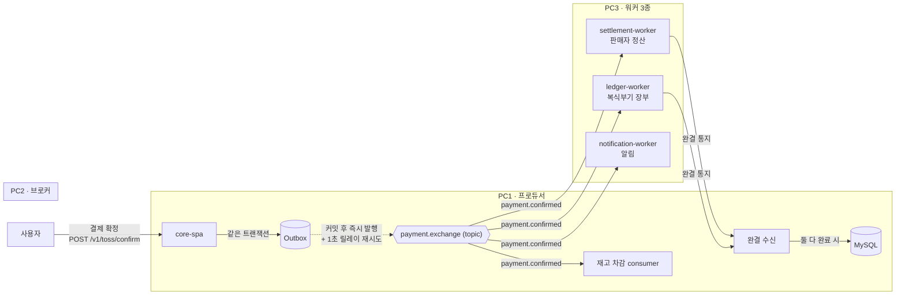

# BookStore — Toss 결제 + 분산 메시징 온라인 서점 (core-mq)

## 프로젝트 개요

> Naver API, Toss API를 활용한 도서 판매 e-commerce 프로젝트 
> (재고 차감·판매자 정산·복식부기 장부·알림)을
> 
> **물리적으로 분리된 3대 PC의 RabbitMQ 파이프라인**으로 구성했습니다.
---

## 기술 스택 (Tech Stack)

| 구분 | 기술 / 라이브러리 | 역할 |
| :--- | :--- | :--- |
| **Language / Framework** | **Java 21, Spring Boot 3.4.8** | 서버 구축, 4개 독립 애플리케이션(프로듀서 + 워커 3종) |
| **Messaging** | **RabbitMQ (Spring AMQP)** | 결제 확정 이벤트의 비동기 분산 처리. Publisher Confirms · Manual ACK · DLX/DLQ |
| **Database** | **MySQL 8** | 주문·결제·장바구니 데이터를 ACID 트랜잭션으로 관리. 결제 과정의 데이터 일관성 책임 |
| **ORM / Query** | **Spring Data JPA** | 엔티티 매핑 및 타입 안전 동적 쿼리 |
| **Payment Gateway** | **Toss Payments (OpenFeign)** | 결제 승인·검증 등 실제 금융 거래 처리 (결제위젯 SDK + 승인 REST API) |
| **Security** | **Spring Security, OAuth2, JWT** | 소셜 로그인(Google·네이버·카카오·GitHub) 후 JWT 발급, Stateless 인가 |
| **Frontend** | **React 18 + TypeScript / Vanilla JS** | 동일 API를 소비하는 SPA·MPA 2종 (성능 비교용) |
| **Test / Load** | **JUnit 5, k6** | 단위 테스트, 부하 테스트(HikariCP 병목·동시성 버그 발견) |
| **Build** | **Gradle** | 의존성 관리 및 빌드 자동화 |

---

## 주요 기능 상세 (Key Features)

### 1. 결제 모듈 (Toss Payments 연동)
- Toss 결제 승인 API를 통한 거래 처리 및 결제 전후 DB 트랜잭션 관리.
- **멱등성(Idempotency)**: `userId + 정렬된 장바구니 항목`을 UUID로 해시한 결정적 주문키로 중복 결제를 시스템적으로 방지(중복 요청은 동일 orderId 반환).

### 2. 사용자 인증 및 보안
- **OAuth 2.0 소셜 로그인** 4종(Google·네이버·카카오·GitHub) — 인가 코드/토큰 교환 플로우.
- **JWT 기반 Stateless 인증** + Spring Security 필터 체인으로 모든 API 요청 토큰 검증.

### 3. 쇼핑 및 주문 관리
- 장바구니 추가/삭제/수량 변경 CRUD, QueryDSL 기반 조회.
- 네이버 도서 검색 API 연동(검색·상세).

### 4. 분산 메시지 파이프라인
- 결제 확정 → **재고 차감·판매자 정산·복식부기 장부·알림**을 RabbitMQ로 비동기 병렬 처리.
- 재고 차감은 `UPDATE ... SET stock=stock-? WHERE stock>=?` **조건부 원자 연산**으로 락 없이 동시성 제어.
- 정산·장부 완결 통지를 수신해 결제를 최종 완결 처리(`is_payment_done`).

---

- **Transactional Outbox**: 결제 상태 전이와 같은 트랜잭션에 발행을 예약 → 커밋 직후 발행 → 실패 시 1초 릴레이 재발행.
- **at-least-once + 멱등 컨슈머**: 모든 워커가 `order_id`/`seller_id` UNIQUE 제약으로 중복 처리 차단.
- **Dead Letter Queue + Manual ACK**: 처리 불가 메시지는 즉시 DLQ로 격리

---

## 아키텍처




## 저장소 구성 (멀티 리포)

| 리포 | 역할 |
|---|---|
| **BookStore**  | core-spa — 프로듀서(결제·주문·인증) + 재고 차감 컨슈머 + 완결 수신 + 프론트엔드 |
| ledger-worker | 복식부기 장부 기록  |
| settlement-worker | 판매자별 지갑 정산  |
| notification-worker | 결제 완료 알림 |

## 로컬 실행

```bash
# 백엔드 (MySQL·RabbitMQ 필요)
./gradlew bootRun

# 프론트엔드 (React)
cd frontend && npm install && npm run dev   # http://localhost:5173
```
