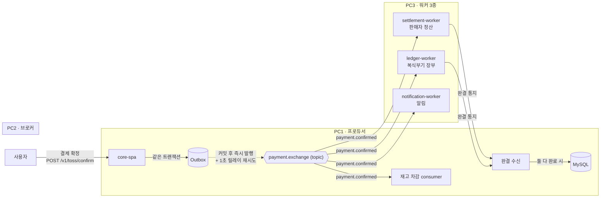

# BookStore — Toss 결제 + 분산 메시징 온라인 서점 (core-mq)

## 프로젝트 개요

> Naver API, Toss API를 활용한 도서 판매 e-commerce 프로젝트 
> (재고 차감·판매자 정산·복식부기 장부·알림)을 **물리적으로 분리된 3대 PC의 RabbitMQ 파이프라인**으로 구성했습니다.
---

## 아키텍처 — 결제 확정 이벤트 하나가 4개 워커로



- **Transactional Outbox**: 결제 상태 전이와 같은 트랜잭션에 발행을 예약 → 커밋 직후 발행 → 실패 시 1초 릴레이 재발행. **발행 유실 원천 차단**.
- **at-least-once + 멱등 컨슈머**: 모든 워커가 `order_id`/`seller_id` UNIQUE 제약으로 중복 처리 차단.
- **Dead Letter Queue + Manual ACK**: 처리 불가 메시지는 즉시 DLQ로 격리(무한 재전달 없음).

---

## 기술 스택 (Tech Stack)

| 구분 | 기술 / 라이브러리 | 역할 |
| :--- | :--- | :--- |
| **Language / Framework** | **Java 21, Spring Boot 3.4.8** | 서버 구축, 4개 독립 애플리케이션(프로듀서 + 워커 3종) |
| **Messaging** | **RabbitMQ (Spring AMQP)** | 결제 확정 이벤트의 비동기 분산 처리. Publisher Confirms · Manual ACK · DLX/DLQ |
| **Database** | **MySQL 8** | 주문·결제·장바구니 데이터를 ACID 트랜잭션으로 관리. 결제 과정의 데이터 일관성 책임 |
| **ORM / Query** | **Spring Data JPA, QueryDSL** | 엔티티 매핑 및 타입 안전 동적 쿼리 |
| **Payment Gateway** | **Toss Payments (OpenFeign)** | 결제 승인·검증 등 실제 금융 거래 처리 (결제위젯 SDK + 승인 REST API) |
| **Security** | **Spring Security, OAuth2, JWT** | 소셜 로그인(Google·네이버·카카오·GitHub) 후 JWT 발급, Stateless 인가 |
| **Frontend** | **React 18 + TypeScript / Vanilla JS** | 동일 API를 소비하는 SPA·MPA 2종 (성능 비교용) |
| **Test / Load** | **JUnit 5, k6** | 단위 테스트, 부하 테스트(HikariCP 병목·동시성 버그 발견) |
| **Build** | **Gradle** | 의존성 관리 및 빌드 자동화 |

---

## 주요 기능 상세 (Key Features)

### 1. 결제 모듈 (Toss Payments 연동)
- Toss 결제 승인 API를 통한 실제 거래 처리 및 결제 전후 DB 트랜잭션 관리.
- **멱등성(Idempotency)**: `userId + 정렬된 장바구니 항목`을 UUID로 해시한 결정적 주문키로 중복 결제를 시스템적으로 방지(중복 요청은 동일 orderId 반환).

### 2. 사용자 인증 및 보안
- **OAuth 2.0 소셜 로그인** 4종(Google·네이버·카카오·GitHub) — 인가 코드/토큰 교환 플로우.
- **JWT 기반 Stateless 인증** + Spring Security 필터 체인으로 모든 API 요청 토큰 검증.

### 3. 쇼핑 및 주문 관리
- 장바구니 추가/삭제/수량 변경 CRUD, QueryDSL 기반 조회.
- 네이버 도서 검색 API 연동(검색·상세).

### 4. 분산 메시지 파이프라인 (핵심)
- 결제 확정 → **재고 차감·판매자 정산·복식부기 장부·알림**을 RabbitMQ로 비동기 병렬 처리.
- 재고 차감은 `UPDATE ... SET stock=stock-? WHERE stock>=?` **조건부 원자 연산**으로 락 없이 동시성 제어.
- 정산·장부 완결 통지를 수신해 결제를 최종 완결 처리(`is_payment_done`).

---

## 기술적 하이라이트 — 측정으로 증명한 것들

이 프로젝트의 차별점은 "구현했다"가 아니라 **"검증했고, 문제를 발견했고, 진단했다"**입니다.

### 부하 테스트로 병목 발견 → 해소 · [문서](docs/load-test-results.md)
| 지표 | 개선 전 (HikariCP pool=10) | 개선 후 (pool=64) |
|---|---|---|
| 성공률 | 0.33% (2/602) | **100%** (1000/1000) |
| p95 지연 | 60초 (타임아웃) | **163ms** (약 367배 개선) |
| 처리량 | ~0 | **242 req/s** |

동시성 20에서 커넥션 풀 고갈이라는, 평시 트래픽에선 드러나지 않던 용량 결함을 규명·해소.

### 부하 테스트가 동시성 버그를 발견
1000건 부하 중 2건(0.2%)에서 완결 수신부의 **lost update**(wallet/ledger 완결 통지 병렬 도착 시 race condition)를 발견.
**순차 처리에선 절대 나타나지 않는** 결함을 부하로 규명 — 부하 테스트의 가치를 보여주는 사례.

### 동시성 전략 4종 실측 벤치마크 · [문서](docs/concurrency-benchmark.md)
같은 재고 차감 워크로드에 낙관적 락·비관적 락·원자 UPDATE·큐 직렬화를 실측 비교.
낙관적 락은 고경합에서 요청당 평균 13.7회 충돌, **큐 직렬화가 최고 성능 락 대비 3.8배 우위**.
MySQL 서버 카운터 교차 검증으로 측정 신뢰성까지 입증.

### 장애 주입 테스트 · [문서](docs/failure-experiments.md)
3대 물리 서버에서 브로커 강제 차단·컨슈머 다운을 주입해 Outbox 자동 복구·Durable Queue 메시지 보존을 검증.

### 오버셀링 실험
재고 5개에 20건 동시 결제 → 결제는 전건 성공, 재고는 5건만 차감, 초과 15건은 DLQ로 격리되어 환불 대상으로 완전 식별.
"결제 성공 ≠ 재고 확보"라는 분산 결제의 본질을 실증.

### React vs 바닐라 JS 성능 비교 · [문서](docs/frontend-comparison.md)
번들 크기 12배 차이(React 93KB vs 바닐라 7.6KB gzip)에도 렌더 성능 차이는 미미(FCP 18ms) —
"이 규모에선 프레임워크 비용이 성능이 아니라 번들 크기로 지불된다"는 결론.

---

## 저장소 구성 (멀티 리포)

| 리포 | 역할 |
|---|---|
| **BookStore** (현재) | core-spa — 프로듀서(결제·주문·인증) + 재고 차감 컨슈머 + 완결 수신 + 프론트엔드 |
| ledger-worker | 복식부기 장부 기록 워커 (PC3) |
| settlement-worker | 판매자별 지갑 정산 워커 (PC3) |
| notification-worker | 결제 완료 알림 워커 (PC3) |

## 문서

- [분산 메시징 전체 기획안](docs/distributed-mq-plan.md) — 물리 배치·설계 결정·페이즈 로드맵
- [부하 테스트 결과](docs/load-test-results.md) — HikariCP 병목·오버셀링·완결 동시성 버그
- [동시성 전략 벤치마크](docs/concurrency-benchmark.md) — 락 4종 실측 + 독립 검증
- [장애 주입 실험](docs/failure-experiments.md) — 브로커/컨슈머 장애 복원력
- [프론트엔드 성능 비교](docs/frontend-comparison.md) — React vs 바닐라

## 로컬 실행

```bash
# 백엔드 (MySQL·RabbitMQ 필요)
./gradlew bootRun

# 프론트엔드 (React)
cd frontend && npm install && npm run dev   # http://localhost:5173
```
> 설정: `application.yml`은 gitignore 처리되며, `application-template.yml`을 복사해 DB·RabbitMQ·API 키를 채운다.
