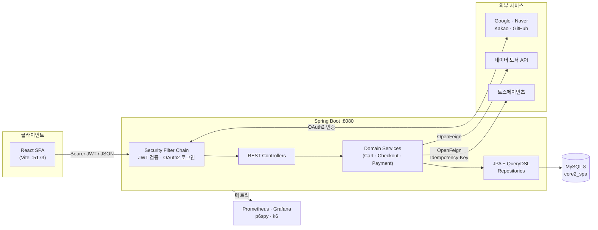
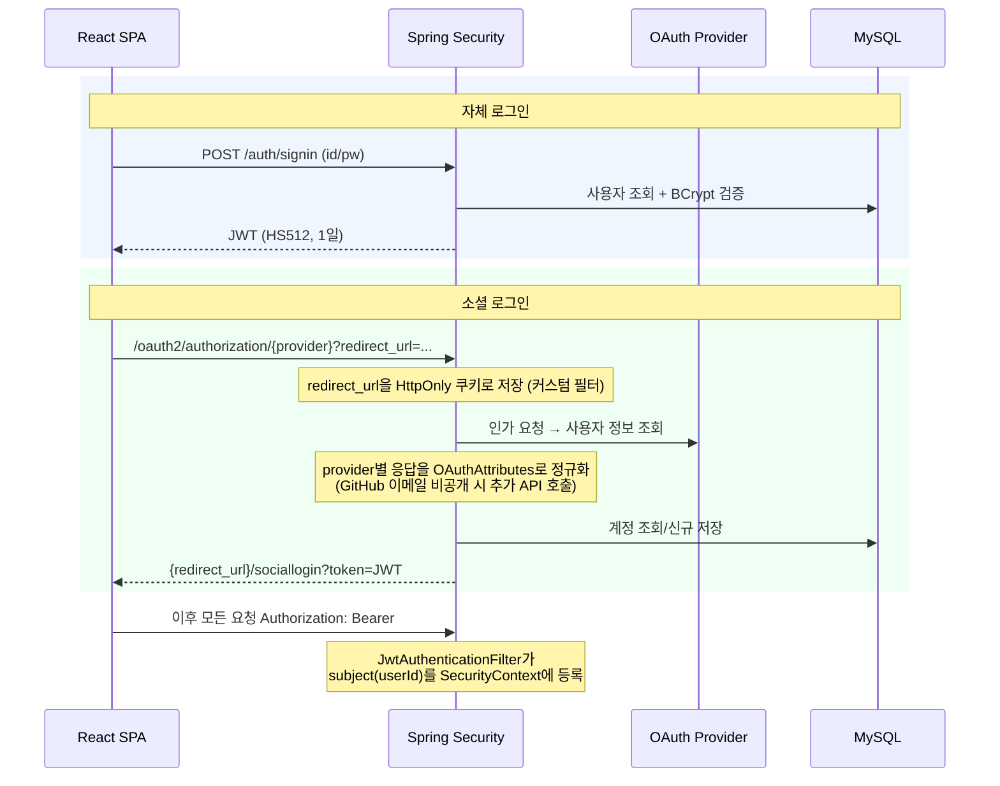
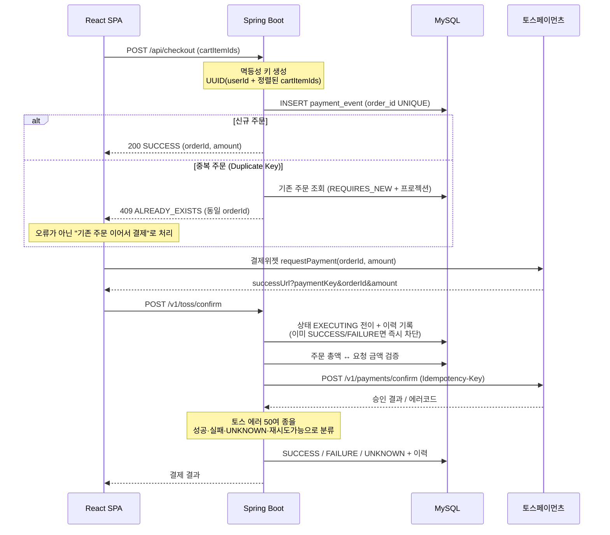
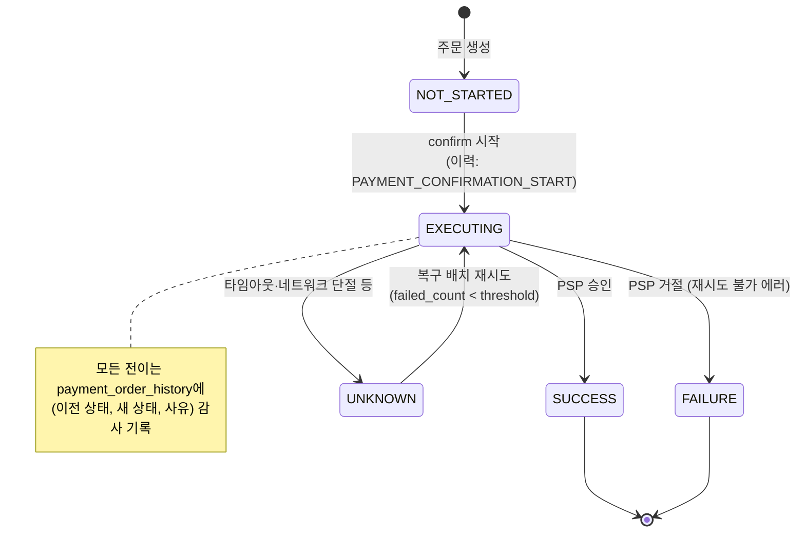
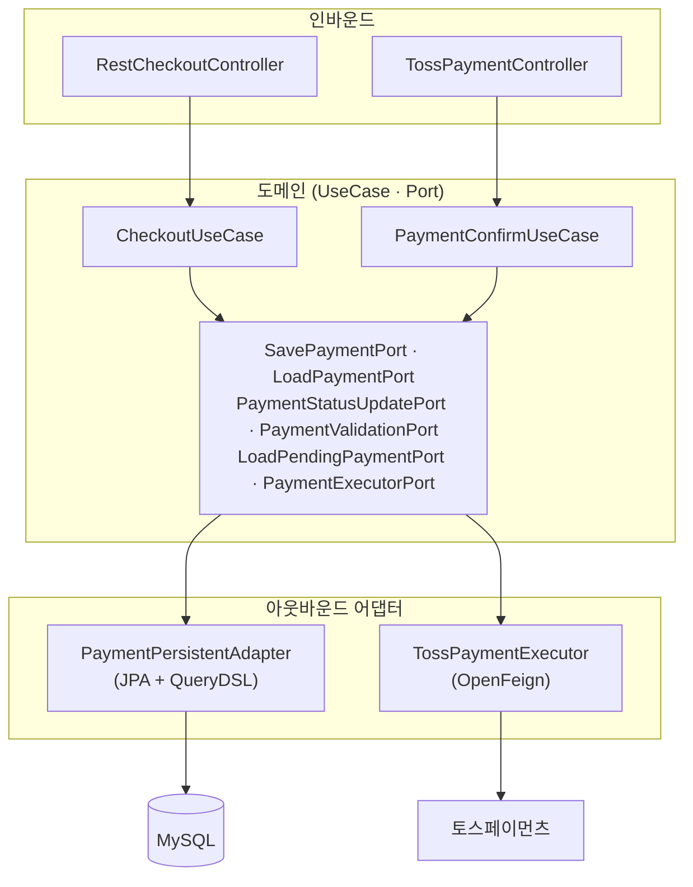
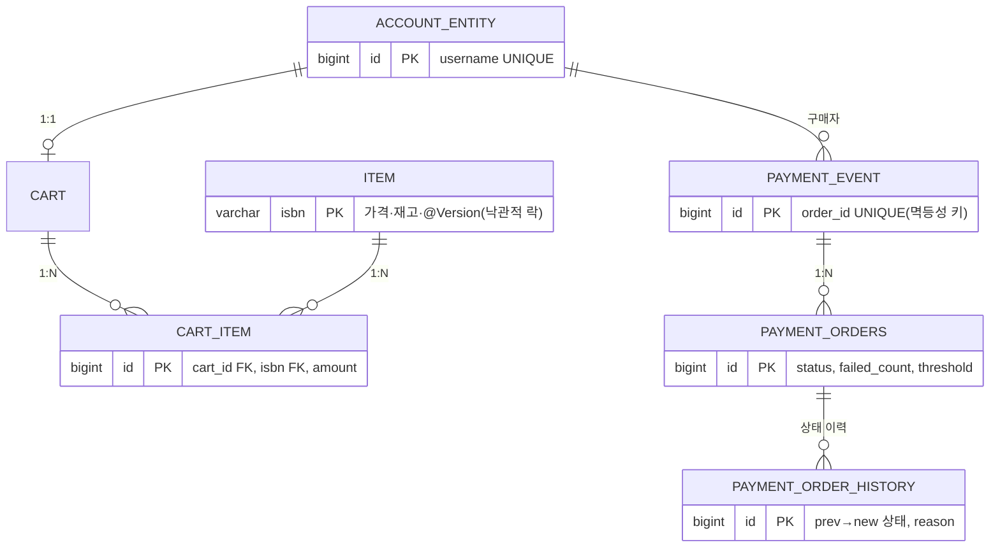

# 🏗️ core 북스토어 — 아키텍처

> 코드 블록의 다이어그램은 노션에서 언어를 `Mermaid`로 지정하면 그림으로 렌더링됩니다.

---

## 1. 시스템 구성도



**포인트**
- 백엔드는 완전한 STATELESS JSON API — 프론트(React SPA)와 CORS 기반으로 분리 배포
- 외부 호출은 모두 OpenFeign으로 통일 (인증 헤더는 RequestInterceptor로 주입)
- 관측 스택(Prometheus/Grafana/k6)은 docker-compose로 일괄 기동

---

## 2. 인증 플로우



---

## 3. 주문·결제 플로우 (멱등성 + 상태머신)



## 4. 결제 상태머신



---

## 5. 결제 도메인 — 헥사고날(포트-어댑터) 구조



**의도**: 결제 핵심 로직이 "DB가 JPA인지, PSP가 토스인지"를 모르게 격리 → PSP 교체·테스트 더블 주입이 포트 단위로 가능

## 6. ERD (핵심 테이블)



---

## 7. 패키지 구조

```
com.bookService.core
├─ common/          공통 응답 DTO · 전역 예외 핸들러 · 에러코드 · 멱등성 키 유틸
├─ config/          Security · JWT · Async 스레드풀 · Batch · p6spy
├─ security/        JWT 필터 · OAuth2 서비스 · 성공 핸들러 · redirect 쿠키 필터
├─ domain/
│   ├─ login/       계정 (회원가입 · 로그인)
│   ├─ item/        상품 (재고 · @Version)
│   ├─ cart/ cartitem/   장바구니 (QueryDSL 프로젝션 조회)
│   ├─ checkout/    주문 생성 (멱등성)
│   └─ payment/     결제 — entity · port · adapter · usecase · persistent(3계층 리포지토리)
├─ infra/
│   ├─ naver/       도서 검색 Feign 클라이언트
│   └─ toss/        결제 승인 Feign 클라이언트 · Executor · 에러 매핑
└─ facade/          재고 락 재시도 Facade (지수 백오프 · @Async)

frontend/ (React SPA)
├─ api/       axios 인스턴스(Bearer 인터셉터) + 도메인별 API 모듈
├─ auth/      AuthContext · ProtectedRoute
├─ pages/     로그인 · 도서 · 장바구니 · 결제 · 콜백 (9개)
└─ types/     백엔드 DTO 대응 TypeScript 타입
```
